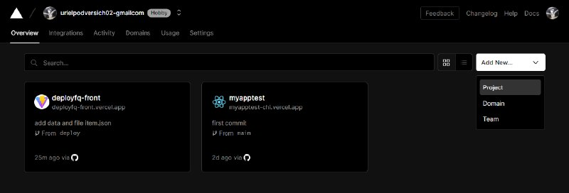
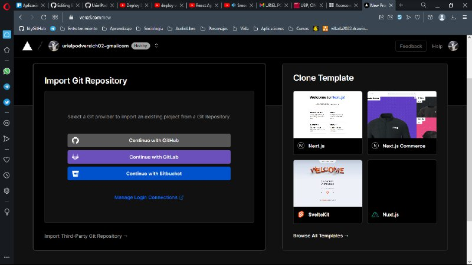
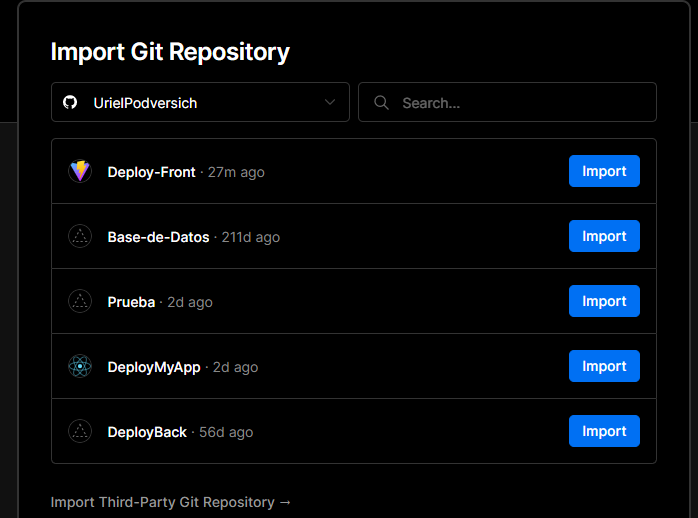
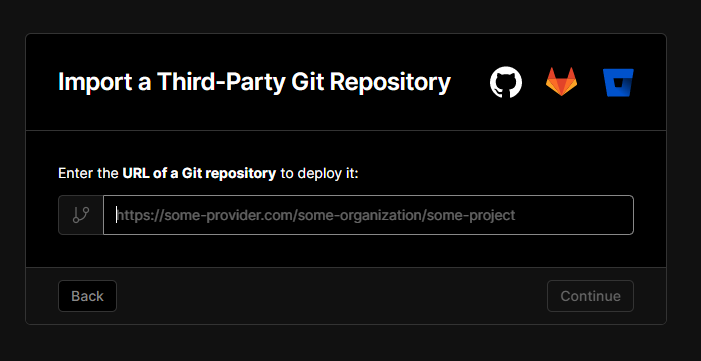
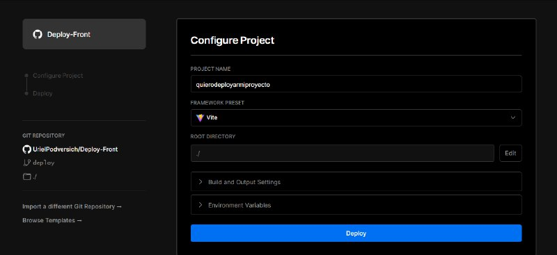
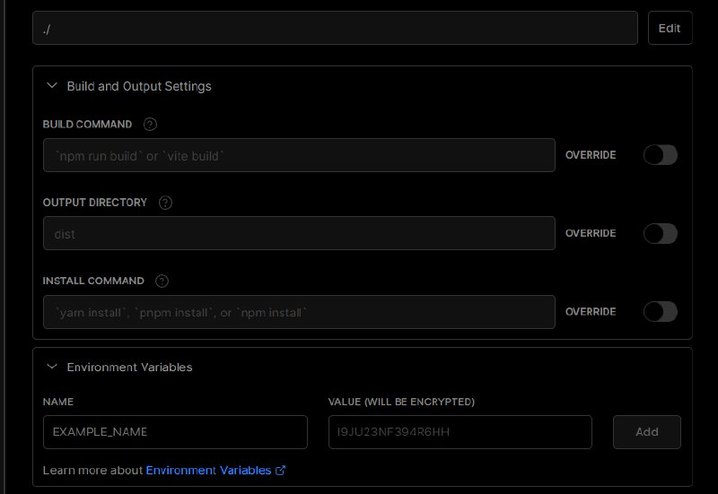
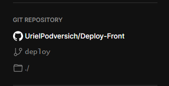
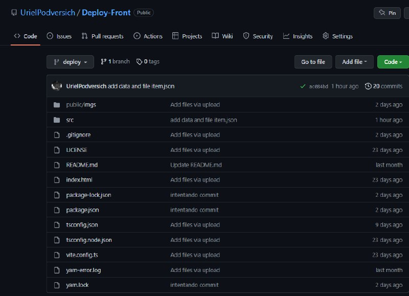
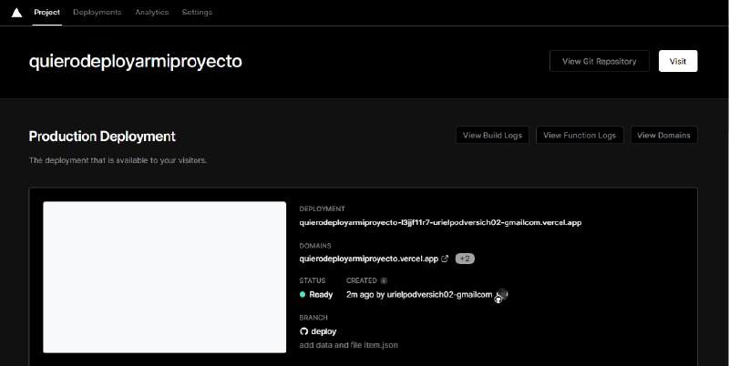
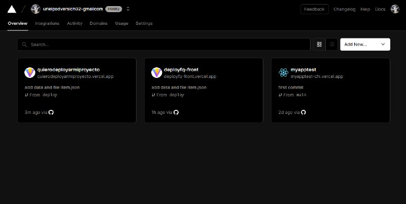

<h2>NOTA:</h2><h3>si ya tienes un repositorio con tu proyecto, ignorar los pasos 1 y 2.</h3>  

<h2>1 Clonar Repositorio: </h2> 

Lo primero que haremos sera clonar el repositorio del proyecto que queramos deployar.  
git clone (link del repositorio)  

<h2>2 Crear Repositorio: </h2> 

Crearemos un repositorio propio, le asignaremos su rama y al proyecto clonado le asignamos la direccion del repositorio. 

git branch (nombre rama)
git remote add (nombre del remote)(link del repositorio)  
git add .  
git commit -m "(input text here)"
 

<h2>3 Inicio Vercel: </h2> 

Una vez hecho eso, iniciaremos sesion en la pagina de vercel para luego poder conectar/vincular nuestra cuenta de GitHub. 
(Pagina de inicio de sesion de vercel): 
https://vercel.com/login?next=

Esta vez nos conectamos con GitHub o mail.
 

<h2>4 Elegir proyecto: </h2>

Una vez logeados nos apareceran los proyectos que tenemos creados, pueden estar deployados o no.  
Iremos a la esquina superior derecha y daremos click a (add new) y daremos a (project) para crear un nuevo proyecto.  

Podremos seleccionar algun template para deployar nuestro proyecto dependiendo del framework que estemos trabajando. Sino, otra forma es directamente estableciendo conexion con GitHub.  

Una vez conectado, se nos mostrara todos los repositorios que tenemos y a su vez, si tiene un framework que Vercel reconozca, se mostrara un logo del mismo.  

Seleccionaremos import al proyecto que queramos deployar.

PD: Si queremos deployar un proyecto que no esta en nuestro repositorio, abajo a la izquierda tenemos un apartado que dice: "Import Third-Party Git Repository →" 

Esto nos dirigira a un apartado donde podremos colocar un link del repositorio que queramos deployar. 
 

<h2>5 Configurar Proyecto: </h2>

Una vez hecho click en import, nos aparecera un apartado para configurar el proyecto.
Configuraremos el nombre del proyecto como mejor nos parezca.  

En este caso le pondremos de nombre: quierodeployarmiproyecto

Esta vez estamos usando Vite, por lo tanto,  automaticamente Vercel me detecta que estamos usando este framework. Por lo que lo vamos a  dejar como esta por default. Pero si quisieramos cambiarlo tambien tendriamos la posibilidad de hacerlo.  

Root Directory, Build and Output Settings y Enviroment Variables; a todos estos los dejaremos por default, osea como nos vino por defecto.  

A la izquierda podemos ver el repositorio que estamos usando y la rama que utilizara la informacion para deployar el proyecto. 

(Nuestro repositorio)

Una vez tengamos todo configurado le daremos click al botón que dice "Deploy".

<b>Y listo!!!</b> Si esta todo correctamente funcionando dentro de tu proyecto no deberia haber problemas. 

Esto nos dara un link que nos redirigira al proyecto en el que estamos trabajando, a su vez nos aparecera este proyecto en el dashboard de Vercel, por si queremos configurar o cambiar algo del mismo. 

<b> Nota: si hay algun incoveniente consultar el error buscando informacion en Google o preguntandole algun compañero. <b>
 